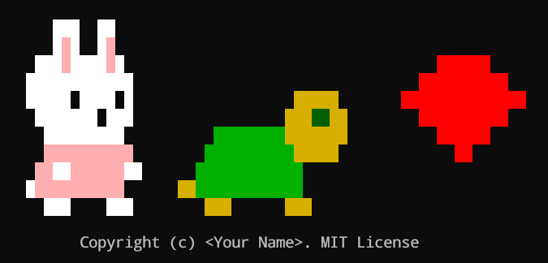

# picoruby-rapicco

Rabbit-like presentation tool for terminal emulator

## Overview

Rapicco is a Ruby-based presentation tool that runs in terminal emulators, inspired by Rabbit presentation software. It provides a way to create and display slides with text formatting, sprite animations, and time-based progression directly in the terminal.

## Features

- **Text rendering with Shinonome fonts**: Uses the picoruby-shinonome gem for Japanese font support
- **Sprite animations**: Includes animated characters (Rapiko and Camerlengo) that move across slides
- **Markdown-like syntax**: Simple text formatting with headers, bullets, colors, and inline styles
- **Code block support**: Syntax highlighting for code sections with triple backticks
- **Time-based progression**: Automatic slide progression with customizable duration
- **Keyboard navigation**: Manual navigation with h/l keys for previous/next slides
- **PNGBIT image support**: Custom image format for terminal display

## Dependencies

- `picoruby-shinonome`: Japanese bitmap font rendering library

## Usage

### Creating a Presentation

Create a presentation file with YAML front matter and markdown-like content.

`slide.md`:

````markdown
---
duration: 1800    # 30 minutes in seconds for example
sprite: hasumikin # Sprite author's name. See mrblib/sprite.rb
---

# Welcome to Rapicco
{align=center, scale=2}

- This is a bullet point
- *Bold text* with emphasis
- *{red}Colored text* in red

```
def hello_world
  puts "Hello, World!"
end
```
````

### Running a Presentation

In R2P2 shell:

```console
rapicco slide.md
```

In PicoRuby runtime:

```ruby
require 'rapicco'

presentation = Rapicco.new('slide.md')
presentation.run
```


### Text Formatting Syntax

#### Headers
```markdown
# Title Text
{align=center, scale=2}
```

#### Bullet Points
```markdown
- Bullet item
- Another item
```

#### Inline Formatting
```markdown
*Bold text*
*{color}Colored text*
```

#### Code Blocks
````markdown
```
puts "Hello World"
```
````

#### Attributes
Text lines can include attribute blocks `{key=value, key2=value2}`:

- `font`: Font name (go12, go16, min12, etc.)
- `scale`: Text scale factor
- `align`: Text alignment (left, center, right)
- `color`: Text color
- `bullet`: Show bullet point (true/false)
- `skip`: Skip lines

### Keyboard Controls

- `h`: Previous slide
- `l`: Next slide
- `Ctrl+C`: Exit presentation

## Components

### Rapicco Class
Main presentation controller that manages slides, sprites, and user interaction.

### Parser Class
Parses markdown-like syntax into structured data for rendering.

### Slide Class
Handles slide rendering using Shinonome fonts and terminal escape sequences.

### Sprite Class
Manages animated characters with color palettes and positioning.

### PNGBIT Module
Custom image format for terminal display with 8-bit color support.

## PNGBIT Format

PNGBIT is a simple image format designed for terminal display:
- 6-byte magic header: "PNGBIT"
- 2-byte width (big-endian)
- 2-byte height (big-endian)
- Image data: one byte per pixel (0 = transparent, 1-255 = color index)

## Animation

Rapicco includes two animated sprites:
- **Rapiko**: A rabbit character that moves based on slide progression. Note that she is `Rapi*k*o`, not `Rapi*c*o`
- **Camerlengo**: He is a tortoise character that moves based on time progression

Both sprites use ASCII art with color palettes and support positioning along the bottom of the terminal.



## Color Support

The system supports 256-color terminal mode with predefined palettes:
- Standard terminal colors (red, green, blue, etc.)
- Custom sprite colors defined in palettes
- Inline color specification in text

## Technical Details

- Uses terminal escape sequences for cursor positioning and color
- Supports alternative screen buffer (DECSET 1049)
- Non-blocking keyboard input for navigation
- Automatic garbage collection for memory management
- Type-safe implementation with RBS signatures

## License

MIT
